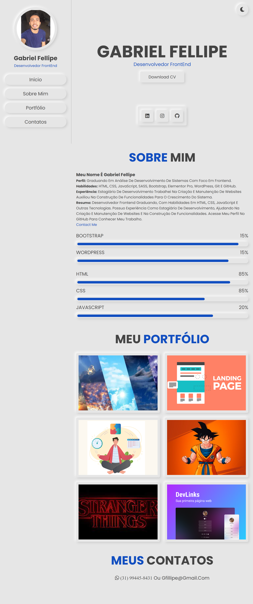

<h1 align="center">Meu Portfólio </h1>

  <a href="#-tecnologias">Tecnologias</a>&nbsp;&nbsp;&nbsp;|&nbsp;&nbsp;&nbsp;
  <a href="#-projeto">Projeto</a>&nbsp;&nbsp;&nbsp;|&nbsp;&nbsp;&nbsp;
  <a href="#memo-licença">Licença</a>

  

 

  

## 🚀 Tecnologias

Esse projeto foi desenvolvido com as seguintes tecnologias:

- HTML e CSS
- JavaScript
- Git e Github

## 💻 Projeto

Portfólio desenvolvido para poder apresentar para as empresas, onde possui alguns projetos, onde mostro minhas habililidades.

## :memo: Licença

Esse projeto está sob a licença MIT.

---

Feito com ♥ by Gabriel F. :wave:
